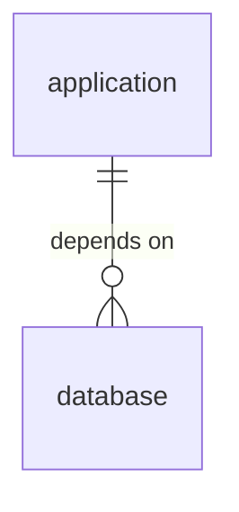
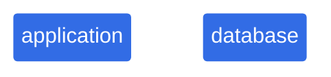
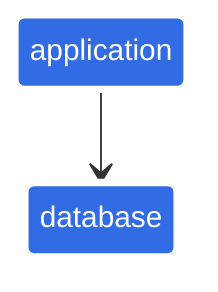
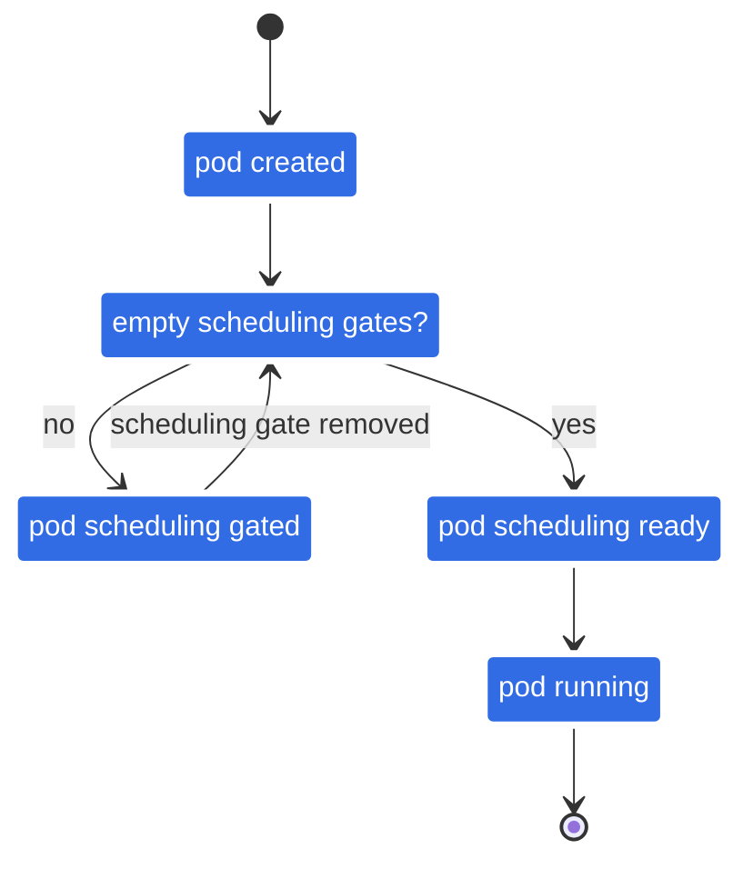

```mermaid!
%%{
    init: {
        "themeCSS": [
            "[id*=entity-] .er.entityBox { fill:#326ce5;stroke:#fff;stroke-width:4px; }",
            ".er.entityLabel { fill:#fff; }"
        ]
    }
}%%

erDiagram
    application ||--o{ database : "depends on"
```

```mermaid!
stateDiagram-v2

    s1: application
    s2: database

classDef k8s fill:#326ce5,stroke:#fff,stroke-width:4px,color:#fff;
class s1,s2 k8s
```

```mermaid!
stateDiagram-v2

    s1: application
    s2: database
    s1 --> s2

classDef k8s fill:#326ce5,stroke:#fff,stroke-width:4px,color:#fff;
class s1,s2 k8s
```

Pod Scheduling Gates:

```mermaid!
stateDiagram-v2

    s1: pod created
    s2: pod scheduling gated
    s3: pod scheduling ready
    s4: pod running
    if: empty scheduling gates?
    [*] --> s1
    s1 --> if
    s2 --> if: scheduling gate removed
    if --> s2: no
    if --> s3: yes  
    s3 --> s4
    s4 --> [*]

classDef k8s fill:#326ce5,stroke:#fff,stroke-width:4px,color:#fff;
class s1,s2,s3,s4,if k8s
```
